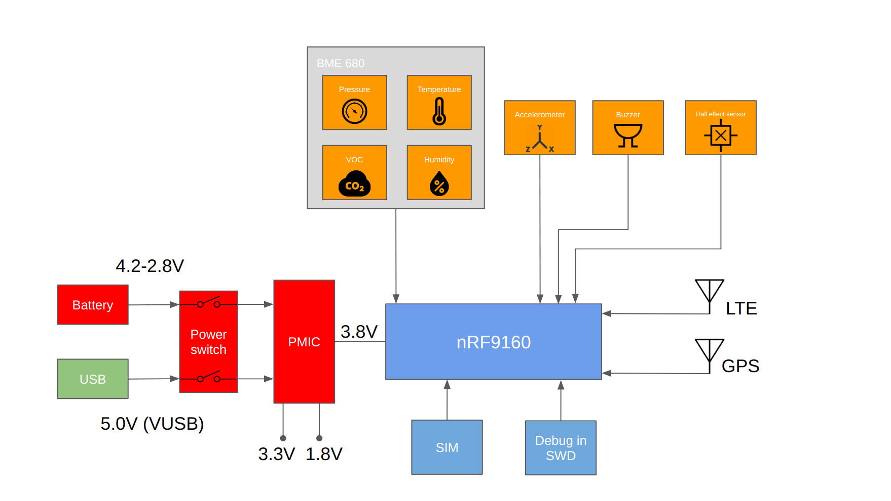

# TrackMyBike
Want to track your bike? Start here!

# Requirements:

The bike tracker shall support:

- Power:
    - The system must be operational while running from a single LiPo/Lion cell @ 4.2-3.0V 
    - Power the system via 5V USB @ 500 mA
    - Be able to charge LiPo/Lion batteries using either:
        - Solar panel
        - 5V USB input
- Support the following cellular connectivity technologies and powersaving features:
    - LTE-M
        - PSM
    - NB-IoT
        - PSM
        - RAI
- Sensors and actuators:
    - Pressure / temperature / VOC / Humidity to do measure relevant environmental parameters
    - Accelerometer to measure movement/cycling speed
    - Buzzer to alert when a bike is stolen
    - GPS tracking which is automatically enabled when:
        - Activated remotely
        - Bike is detected stolen
    - Battery voltage
    - Battery level (%)
- Interfaces:
    - GPIO for general purpose sensors
    - Nano SIM card slot (+ MFF2 SIM slot?)
    - SWD for programming/debugging

# High level block diagram:

